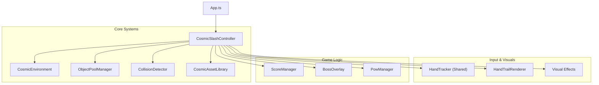

# Cosmic Slash Mode - Design Document

## 1. Vision & User Experience

### Goal

Create a high-energy, arcade-style "beat saber" meets "fruit ninja" experience in a cosmic setting. Users slice through incoming cosmic objects (crystals, meteors, stars) using their hands as lightsabers, building combos and defeating bosses in a visually stunning 3D environment.

### User Experience Flow

1.  **Entry**: User switches to Cosmic Slash mode. The environment transitions to a deep space scene with a procedural starfield and neon lighting.
2.  **Gameplay Loop**:
    - Cosmic objects (crystals, meteors, etc.) spawn in the distance and fly toward the screen.
    - User moves hands to create glowing, energy-ribbon trails.
    - Slicing objects triggers explosions, sound effects, and floating score popups.
    - Consecutive hits build a "Combo" multiplier, increasing score.
3.  **Progression**:
    - As score increases, the game levels up (speed and spawn rate increase).
    - **Boss Encounters**: Periodically, a massive "Boss" object appears. The user must slash it repeatedly to defeat it before it passes.
    - **Power-ups**: Special "POW" mechanics allow for screen-clearing attacks (e.g., two-hand laser beam).
4.  **Feedback**:
    - Visuals: Bloom, screen shake, particle explosions, dynamic lighting.
    - UI: HUD shows Score, Combo, Level, and Boss Health.

---

## 2. Technical Architecture

### 2.1 System Overview

The architecture follows a controller-based pattern, orchestrating Three.js rendering, physics, and game logic.

### 2.2 Component Responsibilities

#### CosmicSlashController

**Purpose**: The central brain of the mode.
**Responsibilities**:

- Manages the Three.js scene, camera, and renderer.
- Runs the main game loop (update & render).
- Coordinates object spawning via `ObjectPoolManager`.
- Feeds hand data to `HandTrailRenderer` and `CollisionDetector`.
- Manages game state (Playing, Paused, Boss Fight).

#### HandTrailRenderer

**Purpose**: Renders high-fidelity, lightsaber-like trails.
**Key Tech**:

- **Custom Shaders**: `ribbonVertexShader` and `ribbonFragmentShader` for a glowing core + aura effect.
- **Smoothing**: Uses `OneEuroFilter` to reduce jitter and latency from hand tracking.
- **Sparkles**: GPU-accelerated particle system for trail embellishments.
- **Logic**: Tracks hands by position continuity (nearest-neighbor) rather than unreliable "Left/Right" labels.

#### CollisionDetector

**Purpose**: Handles interaction between hands and objects.
**Key Tech**:

- **Screen-Space Detection**: Projects 3D object positions to 2D screen coordinates for reliable hit testing against hand trails.
- **Optimization**: Uses a cooldown system to prevent double-hits on the same frame.
- **Depth Check**: Ensures objects are only sliceable when they are close to the "screen plane".

#### ObjectPoolManager

**Purpose**: High-performance object management.
**Key Tech**:

- Pre-allocates `CosmicObject` instances to avoid Garbage Collection spikes.
- Manages lifecycle: `Pooled` -> `Active` -> `Sliced`/`Missed` -> `Pooled`.
- Supports multiple object types (Crystal, Meteor, Star, etc.) with different visual properties.

---

## 3. Core Mechanics

### 3.1 Slicing & Physics

- **Detection**: Raycasting is too expensive/complex for this arcade feel. Instead, we project the 3D object's center to 2D screen space.
- **Hit Test**: If a hand trail segment intersects the object's 2D bounding circle _and_ the object is within a specific Z-depth range, a hit is registered.
- **Velocity**: Slicing requires a minimum hand velocity to register, preventing accidental "touches".

### 3.2 Boss Battles

- **Trigger**: Occurs after a set number of levels or score threshold.
- **Phases**:
  1.  **Warning**: `BossWarningOverlay` flashes, music changes.
  2.  **Active**: Boss object (massive scale) moves slowly across the screen.
  3.  **Combat**: User must slash the boss multiple times (HP system) to deplete its health bar (`BossHud`).
  4.  **Resolution**: Boss explodes (massive particle effect) or escapes (damage penalty).

### 3.3 Power-ups (POW)

- **Mechanic**: A "POW" meter fills up during gameplay.
- **Activation**: Specific gestures (e.g., holding hands together) trigger the `PowManager`.
- **Effect**: `PowLaserEffect` fires a continuous beam or clears all enemies on screen.

### 3.4 Scoring & Combos

- **Base Score**: Points per object type.
- **Combo System**: Consecutive hits within a time window (`comboWindowMs`) increase the multiplier. Missing an object resets the combo.
- **Visuals**: `FloatingScoreEffect` spawns 3D text at the impact site.

---

## 4. Rendering & Visuals

### 4.1 Three.js Configuration

- **Tone Mapping**: `ACESFilmicToneMapping` for cinematic contrast and saturation.
- **Color Space**: `SRGBColorSpace` for accurate color reproduction.
- **Post-Processing**: `UnrealBloomPass` (via `PostProcessingManager`) for the signature neon glow.

### 4.2 Cosmic Environment

- **Background**: A procedural starfield generated on a HTML5 Canvas and mapped to a sphere (`CosmicEnvironment.ts`).
- **Lighting**: Dynamic setup with Ambient, Point, and Rim lights to accentuate object materials.

### 4.3 Visual Effects (VFX)

- **SliceEffect**: Generates a planar mesh at the slice angle to simulate the object being cut in half.
- **ScreenFlashEffect**: Full-screen flash on impact or level up.
- **Particles**: GPU-based particle systems for explosions and trail sparkles.

---

## 5. Performance Considerations

- **Object Pooling**: Essential for maintaining 60 FPS with frequent object spawning/despawning.
- **Geometry Instancing**: Used where possible for identical particles.
- **Shader Optimization**: Custom shaders are optimized to minimize expensive operations in the fragment shader.
- **Adaptive Performance**: The controller monitors FPS and can dynamically adjust visual quality (e.g., particle counts, bloom intensity) if performance drops.
