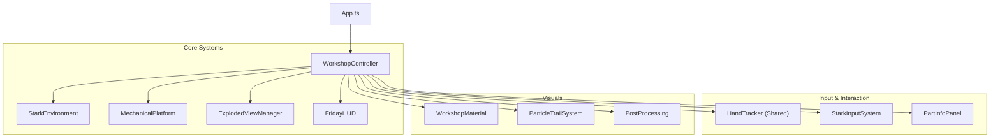

# Iron Man Workshop Mode - Design Document

## 1. Vision & User Experience

### Goal

Create a premium, high-fidelity "Stark Industries Lab" experience where users feel like Tony Stark interacting with his holographic technology. The mode focuses on the inspection, assembly, and detailed appreciation of the Iron Man Mk. III armor in a cinematic, highly responsive environment.

### User Experience Flow

1.  **Entry (Cinematic Startup)**:

    - **Initial Void**: The user enters a dark, minimal grid environment.
    - **System Initialization**: A F.R.I.D.A.Y.-inspired loading overlay initializes systems (0% -> 100%).
    - **Schematic Assembly**: Armor parts fly in from a void state to assemble the suit.
    - **The Scan**: A bright cyan/white laser scans the suit vertically, finalizing the "boot up" sequence.
    - **The Reveal**: The full environment (rings, volumetric lights, screens) fades in, completing the transition.

2.  **Exploration (Assembled State)**:

    - **Turntable Rotation**: User uses a "virtual turntable" gesture (right hand) to rotate the suit reliably.
    - **Contextual Hover**: Hovering over parts triggers a specific "Amber Glow" and reveals a holographic "Info Panel" with technical stats.
    - **Atmosphere**: "God rays" and dynamic lighting react to the user's presence.

3.  **Manipulation (Exploded View)**:
    - **Trigger**: User opens their left hand (Paper gesture) to explode the suit into components; closes it (Rock gesture) to reassemble.
    - **Interaction**: User can pinch (right hand) to grab individual parts, move them closer for inspection, and rotate them using the turntable gesture.
    - **Visuals**: The environment dims, and focus shifts entirely to the floating components with specific "tech" particles.

---

## 2. Technical Architecture

### 2.1 System Overview

The `WorkshopController` acts as the central orchestrator, managing the transition between states and coordinating specialist sub-systems.

### 2.2 Component Responsibilities

#### WorkshopController

- **Role**: Director.
- **Duties**:
  - Manages the main finite state machine (Loading -> Idle -> Exploded).
  - Routes input from `HandTracker` to detailed interaction logic.
  - Orchestrates global transitions (e.g., triggering the startup sequence).

#### StarkEnvironment & MechanicalPlatform

- **Role**: Stage & Set.
- **Duties**:
  - `StarkEnvironment`: Manages volumetric lighting, floor reflections, and background ambience.
  - `MechanicalPlatform`: Handles the realistic rendering of the base platform, including animations and material properties (brushed titanium, carbon fiber).

#### ExplodedViewManager

- **Role**: Choreographer.
- **Duties**:
  - Calculates and interpolates part positions between "Assembled" and "Exploded" states.
  - Manages the "fly-in" animations during the startup sequence.

#### PartInfoPanel

- **Role**: Infographic Interface.
- **Duties**:
  - Renders a 2D/3D hybrid holographic panel near hovered parts.
  - Displays part-specific data (Name, Status, Integrity).
  - Implements specific smoothing to counteract hand jitter for a stable convenient reading experience.

---

## 3. Core Mechanics

### 3.1 Cinematic Startup Sequence

A strictly timed, non-interactive sequence to build anticipation.

- **Phase 1: Boot**: `LoadingOverlay` shows progress.
- **Phase 2: Assemble**: Parts move from `y: 1000` (invisible) to `y: 0` (assembled).
- **Phase 3: Scan**: A Shader-based scan effect passes over the mesh.
- **Phase 4: Live**: Control is handed to the user.

### 3.2 Gesture Controls

Input is divided by hand dominance to prevent conflict.

| Hand      | Gesture             | Action                              |
| :-------- | :------------------ | :---------------------------------- |
| **Left**  | Open Palm           | Trigger **Exploded View**.          |
| **Left**  | Closed Fist         | Trigger **Reassembly**.             |
| **Right** | Pinch (Index+Thumb) | **Grab** & Move specific parts.     |
| **Right** | Horizontal Move     | **Rotate** model (Turntable Logic). |
| **Right** | Index Finger Point  | **Hover** & Reveal Info Panel.      |

_Note: Turntable rotation maps X/Y hand translation to Y/X world rotation for a specialized, predictable feel._

### 3.3 The "Amber Glow"

- **Behavior**: When a part is hovered, it emits a distinct Amber (#FFC107) rim light.
- **Tech**: Custom shader uniform augmentation on the specific mesh material, ensuring it overrides the default blue "idle" glow.

---

## 4. Rendering & Visuals

### 4.1 Visual Style

- **Palette**: Deep charcoal, gunmetal grey, cyan (holograms), amber (interaction).
- **Lighting**:
  - Key Light: Cool Blue/White.
  - Rim Light: Sharp Cyan.
  - Volumetric: "God Rays" using localized fog sprites or shader trickery.

### 4.2 Materials

- **Armor**: High-gloss metallic PBR with slight wear/scratches.
- **Holograms**: Additive blending, scanline shader effects, Fresnel transparency.

### 4.3 Post-Processing

- **Bloom**: `UnrealBloomPass` is essential for the glowing interfaces and engine lights.
- **Tone Mapping**: `ACESFilmic` for cinematic contrast.

---

## 5. Performance Considerations

- **Raycasting**: Throttled to every nth frame or based on distance delta to save CPU cycles during hover detection.
- **Geometry**: High-poly armor parts used only for the main suit; lower LODs used if available (though current target is high-end desktop web).
- **Particles**: GPU-instanced particles for the startup sparks and ambient dust to maintain 60FPS.

---

## 6. Audio Design

### 6.1 Philosophy

The audio experience is designed to be **tactile, spatial, and cinematic**. It's not just about playing sounds; it's about grounding the holographic interface in reality. Every interaction—from a subtle hover to a major assembly—should have a distinct sonic signature that reinforces the "Stark Tech" aesthetic.

### 6.2 Technology

- **Positional Audio**: Utilizes Three.js `PositionalAudio` to attach sounds to specific 3D objects (e.g., the schematic, specific limbs). This ensures that as the user rotates or moves around the model, the sound originates from the correct location.
- **Global Audio**: Ambient hums and UI blips are handled globally to provide a consistent backdrop.

### 6.3 Soundscape Breakdown

#### Ambience

- **Workshop Hum**: A deep, steady, low-frequency drone that runs continuously. It provides the "room tone" of a high-tech lab.

#### User Interface (UI)

- **Hover Details**: A subtle, high-pitch digital "blip" when hovering over parts. It signals that information is available without being intrusive.
- **Loading Loop**: A rhythmic computing/typing sound during the initial F.R.I.D.A.Y. system initialization.

#### Mechanics & Interaction

- **Assembly/Disassembly**:
  - **Fly-by**: Sharp "whooshes" as parts fly in from off-screen.
  - **Part Lock**: A tight, percussive dampening impact (0.3s) when a part physically connects to the main body.
  - **Servo Whir**: Mechanical motor sounds during the exploded view transition.
- **Rotation**:
  - **Schematic**: A heavy, geared mechanical sound that plays while rotating the entire suit.
  - **Part Manipulation**: A lighter, servo-based sound when rotating individual components in hand.

#### Feedback

- **Scan Beam**: A rising, high-energy sweep that syncs with the visual laser scan.
- **Energy Surge**: A powerful discharge sound accompanying the final system activation and holographic flash.
