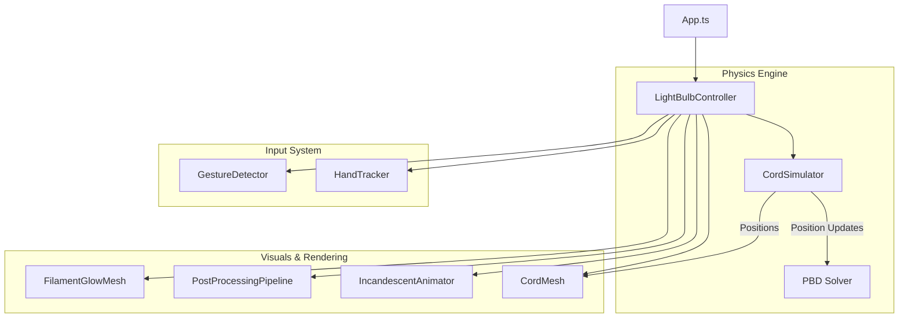

# Light Bulb Mode - Design Document

## 1. Vision & User Experience

### Goal

Create a hyper-realistic, tactile digital toy that demonstrates the power of web-based physics and rendering. The user interacts with a hanging incandescent light bulb, feeling the weight of the cord and the heat of the filament through visual feedback. The experience is designed to be "satisfying" above all else.

### User Experience Flow

1.  **Entry**: A lone, unlit industrial light bulb hangs in a dark void.
2.  **Interaction**:
    - **Pinch & Drag**: The user can pinch the air to "grab" the bulb's cord.
    - **Swing**: Moving the hand causes the cord to swing realistically, reacting to gravity and momentum.
    - **Pull**: Pulling down firmly clicks the switch, flooding the scene with warm light and volumetric God Rays.
3.  **The "Wow" Moment**:
    - **Physicality**: The cord isn't a static line; it's a simulated physical chain of beads.
    - **Destruction**: If the user gets too aggressive and jerks the cord repeatedly, it physically snaps, falling to the floor and cutting the light.

---

## 2. Technical Architecture

### 2.1 System Overview

The system follows a component-based architecture orchestrated by the `LightBulbController`. It separates physics (Logic), interaction (Input), and rendering (Visuals) into distinct layers.

### 2.2 Key Components

#### `LightBulbController.ts`

The central brain. It maintains the state machine (`LightState`, `CordState`, `InteractionState`) and bridges the gap between Hand Tracking input and the Physics Engine.

#### `CordSimulator.ts` (The Physics Core)

A custom **Position Based Dynamics (PBD)** engine responsible for the realistic motion of the cord. It moves particles based on gravity and constraints rather than traditional forces.

#### `PostProcessingPipeline.ts` (The Cinematic Filter)

Manages the `EffectComposer` stack to deliver "God Rays" (crepuscular rays), high-quality Bloom, and Vignette effects using the `postprocessing` library.

---

## 3. Physics Engine: Position Based Dynamics (PBD)

The cord is **not** a traditional rigid body. It is simulated using **Position Based Dynamics**, a technique used in film CGI (Pixar/Disney) for hair and cloth simulation because of its unconditional stability.

### 3.1 Simulation Loop

Executed every frame (fixed time-step accumulation):

1.  **External Forces (Prediction)**:
    - Gravity is applied (`-9.81 m/s²`) to all unpinned particles.
    - Velocity is added to current position to "predict" where the particle wants to go.
2.  **Constraint Solving (The "Tug-of-War")**:
    - The solver iterates **10 times** per frame.
    - **Distance Constraint**: Enforces that every bead stays exactly `segmentLength` apart.
    - If Bead A and Bead B are too far apart, they are instantly projected towards each other.
3.  **Integration (Verlet)**:
    - Velocity is not stored explicitly but inferred: `v = (currentPos - prevPos) / dt`.
    - **Damping**: `0.99` factor applied to mimic air resistance.
4.  **Collision Handling**:
    - **Floor Plane**: Particles below `y = -3.0` are projected up.
    - **Friction**: Horizontal velocity is multiplied by `0.85` on contact.
    - **Sleep Threshold**: If velocity < `0.01`, the particle enters "sleep" mode to prevent micro-jitter.

### 3.2 Dynamic Anchoring

The simulation anchor (Particle 0) is driven by the 3D Model.

- On load, we traverse the GLB to find the cord geometry's bounding box top-center.
- Because the GLB cord is static, we **hide** the mesh (`mesh.visible = false`) and spawn the dynamic `CordSimulator` at that exact world position.
- When the user rotates the bulb, the `CordSimulator` anchor is updated, and the PBD solver naturally propagates that movement down the chain as a wave.

---

## 4. Interaction & Breaking Mechanic

### 4.1 Hand Tracking Integration

- **Mapping**: Hand pinch position is mapped to the nearest cord particle (usually the bottom handle).
- **Smoothing**: Raw hand data is noisy. We apply **Exponential Smoothing** (`lerp factor 0.3`) to the target position, giving the cord a sense of "weight" and inertia.

### 4.2 Material Fatigue (Breaking Logic)

To make the cord feel like a real object, we model **Material Fatigue**. It doesn't break randomly; it breaks based on stress accumulation.

**The Algorithm (`CordFatigueState`):**

1.  **Stress Accumulation**:
    - A pull is "Aggressive" if:
      - Downward Velocity > `1.2` units/sec
      - Cord Extension > `1.4x` resting length
    - If aggressive, **Stress** increases by `0.35` (0.0 to 1.0+ scale).
2.  **Stress Decay**:
    - Stress naturally dissipates at `0.02` per second when idle.
3.  **Deferred Breaking (The "Snap" Effect)**:
    - If Stress > `0.7` (Threshold), the cord enters a **Pending Break** state.
    - It does **not** break immediately (which feels anti-climactic).
    - It waits for an **Upward Bounce** (Velocity Y > `1.5`). This creates the visual effect of "snapping" on the rebound.
4.  **Safety Valve**:
    - If the cord is stretched absurdly far (> `2.2x`), it triggers an **Instant Snap** to prevent physics explosions.

---

## 5. Visuals & Rendering

### 5.1 Instanced Rendering (`CordMesh.ts`)

- **Technique**: `THREE.InstancedMesh`
- **Why?**: Renders 16 high-fidelity sphere geometries with a single draw call.
- **Material**:
  - `MeshStandardMaterial`
  - Color: `0xb8860b` (Dark Golden Rod)
  - Metalness: `1.0` (Fully metallic)
  - Roughness: `0.3` (Shiny but slightly worn)

### 5.2 Incandescent Animation (`IncandescentAnimator.ts`)

Simulates the thermal inertia of a tungsten filament.

- **Warm Up**: 0.18s curve. Color shifts from `1900K` (Candle) -> `2700K` (Warm White).
- **Cool Down**: 0.25s curve. Light lingers briefly after being switched off.

---

## 6. Cinematic Post-Processing

The "premium" feel comes from the `PostProcessingPipeline`. We use `HalfFloatType` frame buffers to support HDR (High Dynamic Range) values > 1.0.

### 6.1 Volumetric God Rays

- **Source**: Hidden `FilamentGlowMesh` inside the bulb.
- **Settings**:
  - Samples: `60`
  - Density: `0.96`
  - Decay: `0.93`
  - Weight: `0.4`
- **Result**: Light shafts explicitly track the filament geometry, even as the bulb rotates.

### 6.2 Realistic Bloom

- **Mipmap Blur**: Enabled. This creates a soft, "dreamy" haze rather than the sharp, digital bloom standard in basic WebGL.
- **Dynamic Intensity**: Bloom strength pulses from `0.0` (Off) to `1.5` (On).

---

## 7. Performance Considerations / Constants Source of Truth

| Constant         | Value           | Description                            |
| :--------------- | :-------------- | :------------------------------------- |
| `gravity`        | `(0, -9.81, 0)` | World gravity vector                   |
| `segmentCount`   | `16`            | Number of beads in the chain           |
| `iterations`     | `10`            | Physics solver passes per frame        |
| `damping`        | `0.99`          | Air resistance (energy loss per frame) |
| `groundFriction` | `0.85`          | Horizontal slowdown on floor contact   |
| `sleepThreshold` | `0.01`          | Velocity below which physics pauses    |
| `bloomThreshold` | `0.2`           | Light brightness needed to glow        |
| `maxStretch`     | `2.2`           | Multiplier for instant break           |
