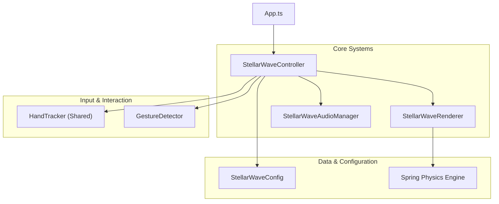

# Stellar Wave Mode - Design Document

## 1. Vision & User Experience

### Goal

Create a mesmerizing, "Interactive Cosmos" experience where users manipulate the very fabric of space-time. The visual representation is a minimal, elegant grid of stellar dots that reacts with fluid, spring-based physics to the user's hand gestures. The mode emphasizes flow, responsiveness, and "cosmic" forces like gravity, repulsion, and entropy.

### User Experience Flow

1.  **Entry (The Void)**:
    - The user enters a calm state with a perfectly ordered grid of points.
    - Subtle ambient motion ("stellar drift") keeps the scene alive.

2.  **Interaction (The Conductor)**:
    - **Ripple**: A simple pinch creates expanding waves, like a stone dropped in a celestial pond.
    - **Forces**: Users can "grab" space to create gravity wells, or push it away with force fields.
    - **Chaos**: Advanced gestures trigger massive events like Quasar Surges or Nebula Vortexes, disrupting the entire grid before it elastically returns to order.

3.  **Audio-Visual Synesthesia**:
    - Every visual force has a corresponding audio texture.
    - Gravity hums with low frequencies; ripples "ping" with crystalline clarity; bursts explode with rich resonance.

---

## 2. Technical Architecture

### 2.1 System Overview

The `StellarWaveController` serves as the primary loop manager, orchestrating the `HandTracker`, `GestureDetector`, `StellarWaveRenderer`, and `StellarWaveAudioManager`.

### 2.2 Component Responsibilities

#### StellarWaveController

- **Role**: Orchestrator.
- **Duties**:
  - Maintains the game loop and state machine (UNINITIALIZED -> RUNNING -> PAUSED).
  - Feeds frame timestamps to tracking and rendering systems.
  - Maps high-level gestures (from `GestureDetector`) to specific renderer effects and audio triggers.
  - Manages debug overlays and performance monitoring.

#### StellarWaveRenderer

- **Role**: Physics & Visual Engine.
- **Duties**:
  - **Grid Simulation**: Manages thousands of `MeshPoint` objects, each with position, velocity, and spring physics.
  - **Force Application**: Applies vector fields for Gravity Wells, Vortexes, and Repulsion.
  - **Canvas Rendering**: optimizing draw calls to render the dot grid efficiently at 60fps.

#### GestureDetector

- **Role**: Input Interpreter.
- **Duties**:
  - Analyzes raw hand landmarks.
  - Detects semantic gestures (Pinch, Fist, specific finger associations).
  - Provides stateful events (STARTED, ACTIVE, ENDED) to the controller.

#### StellarWaveAudioManager

- **Role**: Sonic Feedback.
- **Duties**:
  - Synthesizes procedural audio for continuous forces (Gravity, Vortex).
  - Plays one-shot samples for discrete events (Ripples, Bursts).
  - Modulates frequency and volume based on interaction intensity.

---

## 3. Core Mechanics

### 3.1 Physics Simulation

The core is a grid of localized spring-mass systems.

- **Hooke's Law**: Each dot wants to return to its `restPosition`.
- **Damping**: Velocity decays over time to prevent infinite oscillation.
- **Propagation**: While currently localized, future iterations may implement neighbor-propagation for true wave mechanics (currently simulated via expanding radius checks).

### 3.2 Gesture Controls

Distinct gestures trigger unique cosmic forces. Some gestures work on specific hands for ergonomic separation, while others are ambidextrous for accessibility.

| Gesture          | Hand  | Effect                           | Name           |
| :--------------- | :---- | :------------------------------- | :------------- |
| **Index Pinch**  | Right | Creates an expanding ripple wave | Cosmic Pulse   |
| **Index Pinch**  | Left  | Creates a repulsion force field  | Force Field    |
| **Middle Pinch** | Both  | Strong attraction point          | Gravity Well   |
| **Ring Pinch**   | Both  | Spiraling rotational force       | Nebula Vortex  |
| **Pinky Pinch**  | Both  | Plucks grid lines like strings   | Cosmic Strings |
| **Fist**         | Both  | Charge up -> Explode on release  | Quasar Surge   |

### 3.3 Interactive Behaviors

#### Quasar Surge (Two-Phase)

1.  **Charge (Hold Fist)**: Particles spiral inward toward the hand center. Audio pitch rises. Energy accumulates.
2.  **Burst (Release)**: Stored energy releases as a massive outward shockwave. Dots fly outward with high velocity before springing back.

#### Nebula Vortex

- Applies a tangent force vector relative to the hand center.
- Creates a swirling galaxy effect around the user's fingers.

---

## 4. Rendering & Visuals

### 4.1 Visual Style

- **Palette**: Minimalist. High-contrast white/cyan dots on deep black background.
- **Feedback mechanisms**:
  - **Size**: Dots scale up when affected by forces (Ripples, Proximity).
  - **Color**: Dots shift from neutral white to Cyan/Blue during active disturbances.
  - **Connections**: (Future) Dynamic lines connecting neighbor points during high-stress states (Cosmic Strings).

### 4.2 Optimization

- **Canvas 2D**: Currently using Canvas API for broad compatibility and "perfect circle" rendering.
- **Batch Processing**: Physics updates are vectorized where possible (iterating flat arrays).
- **Spatial Hashing**: (Planned) For optimization if grid density increases significantly.

---

## 5. Audio Design

### 5.1 Philosophy

"Sci-Fi Organic". Sounds should feel like manipulated energy fields rather than mechanical machines.

- **Continuous Sounds**: Loops that modulate pitch/gain based on gesture proximity (e.g., Force Field hum).
- **Impulse Sounds**: Clean, resonant pings for ripples.
- **Dynamic Mixing**: Audio ducking ensures the "Quasar Burst" cuts through the mix when triggered.
